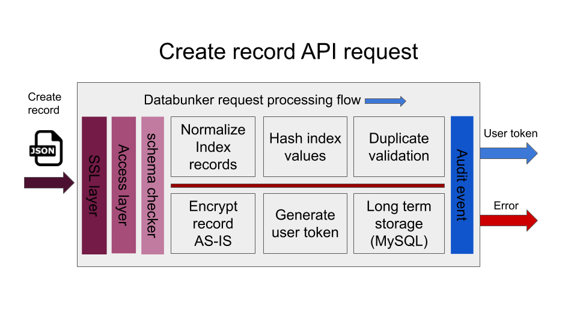

Databunker is a complex system that has many different pieces. This document will help you to understand the Databunker high-level concepts and architecture.

**You can think of **Databunker** as a **vault** for personal records with a twist.**

**Vault** products are well-known. For example Hashicorp Vault, or cloud-based tools like AWS Secrets Manager or GCP Secret Manager. These tools store binary secret values in an encrypted form. These secret values can be database passwords, user private keys, or API tokens. The **vault** knows to encrypt the secret value and store it and provide an API for easy access.

Databunker has another use-case. It can be used to secretly store the whole user record. This record can include a user name, IP address, password, credit card, blockchain keys, healthcare information, etc... Databunker expects to receive the whole user record in JSON format. Databunker stores encrypted records in the back-end database. Out of the personal record, before encryption, Databunker knows to extract the user's email address, phone number, login value if present, and builds a search index. This search index is also hashed on the database level. So, if the attacker gains access to the Databunker back-end database, everything is encrypted or hashed including the search index.

After saving the user's personal data record, Databunker provides you an API to lookup user records using the **email address**, **phone number**, **login name** or a **token** received when you create a user record.

Databunker was built with privacy in mind and this is where the product really shines. It provides GDPR compliance, i.e. an audit of changes, handling for user requests like forget-me requests, user request change management, optional DPO approval, etc...

From a technical perspective, the product has many additional features, like the expiration of records, shareable record identities; additional user records, etc...

