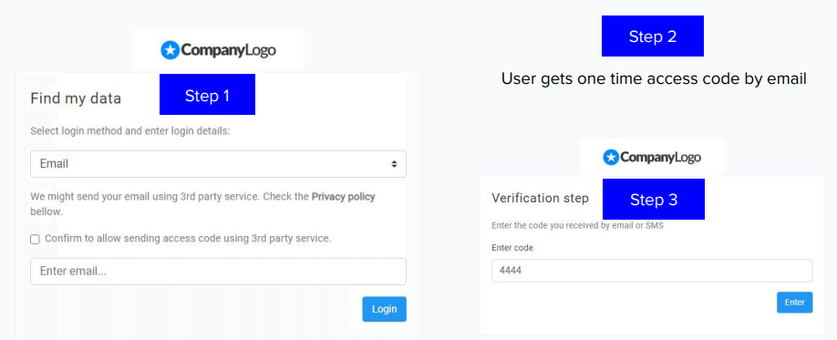

Databunker gives your customers **passwordless access** to the **Databunker User Privacy Portal**. Upon login attempt, **Databunker** sends your customer a **one-time access code**. This code is sent by SMS or email.

### Databunker helps with the following GDPR requirements:

* **Access**: your customers can sign into their Databunker account and view personal data.
* **Withdraw**: your customers can withdraw consents (agreements) given previously.
* **Update**: your customers can change their personal data saved in Databunker. For example, change email address.
* **Delete**: your customers can file a "forget-me" request using Databunker.
* **Restrict**: your customers can manage their agreements using Databunker.
